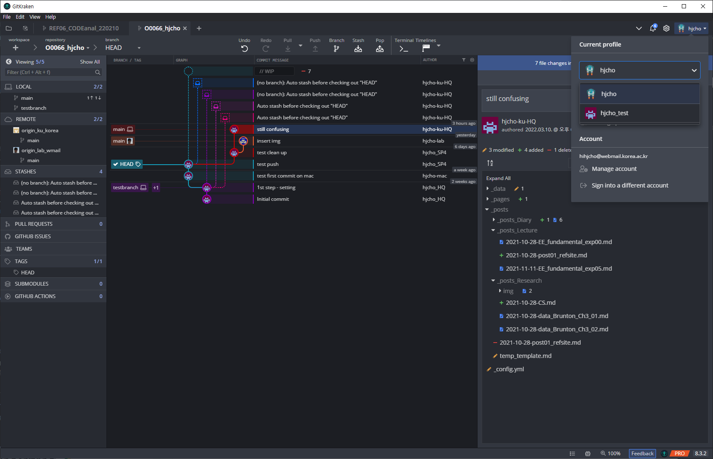
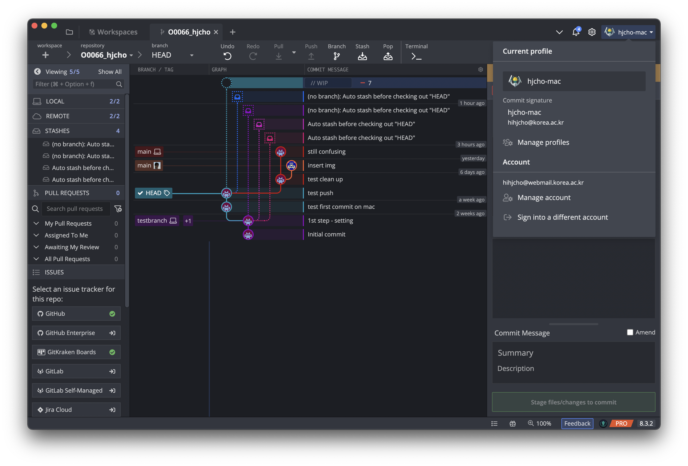
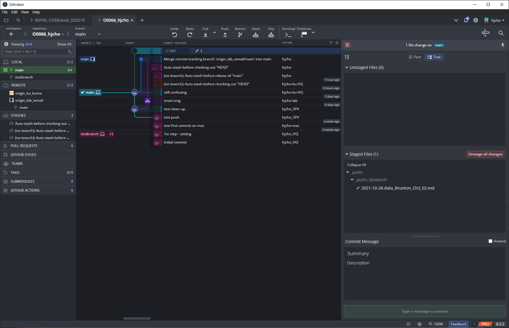

# GitKraken 
- **PC와 MAC에서의 GitKraken profile 차이** 두 대의 머신 모두 Github hihjcho@webmail.korea.ac.kr 계정(account)으로 로그인하였는데, 각 머신에서 사용하는 profile이 왜 통일되지 않는가?
  - profile과 account는 서로 다른 의미임을 생각해야 한다.
  - 

- commit history에서도 확인할 수 있듯이 엉망이고, 꼬여버렸다. 어떻게 매듭을 풀 수 있을까?
- 

Push 수행 시 에러 발생으로 merge 이후에 push을 수행함

# 
This is test inline equation, \\(x=Fa\\).
