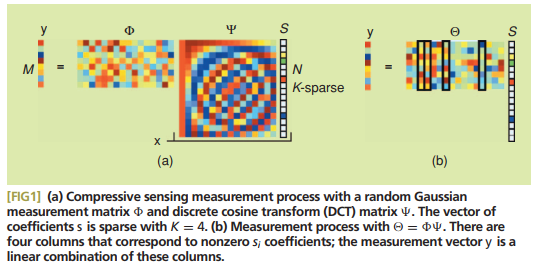

 

# section 3.5 Sparse regression, p113

**Outlier rejection and robustness, p114**

# section 3.6 Sparse representation, p118

<<<<<<< HEAD:_posts/_posts_Research/2021-10-28-data_Brunton_Ch3_02.md

</img>
=======
>>>>>>> main:_posts/2021-10-28-data_Brunton_Ch3_02.md
